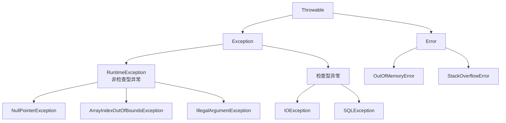
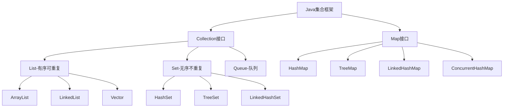

```java
import java.util.*
import java.io.*
```

多写一些注释

把test程序瞅一眼

## 选择题

**1.关键字含义**

`goto`：没有被实现，保留了

`package`：用来声明这个文件属于哪个包`package com.example;`

`instanceof`：类型检查`animal instaceof Dog`

`transient`：序列化时忽略字段，`private transient String password;`不会被序列化（安全敏感）

`strictfp`：严格浮点计算，在每个平台上运算结果相同

`volatile`：保证可见性，`volatile boolean flag`，修改大家可以立刻看到

`native`：本地方法，`native void method()`调用一些C/C++的函数

**2.构造方法的定义（含义，长相，写法，要求）**

```java
[public|protected|private] ClassName([param list]){
    //方法体，没有返回值，不是void
}
```

**3.this和super的用法**

```java
//用于解决局部变量与成员变量同名的问题
//用于解决方法参数与成员变量同名的问题
this.name = name;
//用来调用该类的另一个构造方法
public Employee(){
    this("张明月", 28, 5000);
}
```

`this`关键字不可用于static方法中

super关键字，用来引用当前对象的父类对象

```java
//在子类中调用父类中被隐藏的成员变量
super.variableName;
//在子类中调用父类中被覆盖的方法
super.methodName([paramlist]);
//在子类中调用父类的构造方法
super([paramlist]);
```

**4.final的用法**

+ final修饰类，则这个类不能被继承
+ final修饰方法，不可以被子类覆盖，就是重写/覆盖`@Override`
+ final修饰变量，可以修饰类成员变量、方法的参数和方法的局部变量

```java
class Test{
    public static final int SIZE = 50;
    public void methodA(final int i){
        i = i + 1; //该句产生编译错误，不可以改变i的值
    }
    public int methodB(final int i){
        final j = i + 1; //语句没有错误，可以使用i的值
        return j;
    }
}
```

+ final修饰引用变量，则这个引用变量不可以指向另一个对象，但是这个对象本身可以改变

**5.基本数据类型**

整数类型：byte, short, int, long

浮点类型：float, double

字符类型：char

布尔类型：boolean

**6.接口的含义（如何实现接口）**

`class AA implements BB{}`

**7.字符串比较（“==”和equals）**

`==`：比较内存地址（引用相等），检查是否为同一个对象

equals：比较内容是否相同

`equalsIgnoreCase()`：比较内容，大小写不敏感

**8.异常（finally块）（file异常）**

file读取中，很多都会抛出`IOException`

线程中`sleep()`函数会抛出`InterruptedException`

**9.多线程（两种方法实现，如何编写程序）（start, stop, notify含义，用在什么条件/状态下）**

+ 实现Runnable接口中的run方法，然后创建Runnable对象，放到`Thread()`中去创建线程
+ 继承`Thread`类，重写`run`方法，直接创建对象即可

**10.父类做表示，子类去new，调用的具体是哪个方法**

向上转型是自动的，调用的是子类与父类共有的方法，具体是子类的实现，==父类引用不能调用子类特有的方法==

如果一个方法父类有，子类没有重写，那就是调用父类的

静态方法需要用对应的类名来调用

==私有方法，子类中不是重写，只是单纯同名，还是调用父类的==

父类对象想转换为子类对象，要求父类对象是用子类构造方法生成的

---

## 程序实现题

**1.抽象类、抽象方法（泛型）**

抽象类中可以定义具体方法

具体实现的时候，构造方法中可以用`super`调用抽象类构造方法

```java
import java.util.ArrayList;
import java.util.List;

// 1. 图形抽象类（保留抽象类和抽象方法）
abstract class Shape {
    public abstract double getArea();
    public abstract void displayInfo();
}

// 2. 具体图形类（保留继承和多态）
class Circle extends Shape {
    private double radius;
    
    public Circle(double radius) {
        this.radius = radius;
    }
    
    @Override
    public double getArea() {
        return Math.PI * radius * radius;
    }
    
    @Override
    public void displayInfo() {
        System.out.printf("圆形: 半径=%.1f, 面积=%.2f%n", radius, getArea());
    }
}

class Rectangle extends Shape {
    private double length;
    private double width;
    
    public Rectangle(double length, double width) {
        this.length = length;
        this.width = width;
    }
    
    @Override
    public double getArea() {
        return length * width;
    }
    
    @Override
    public void displayInfo() {
        System.out.printf("矩形: 长=%.1f, 宽=%.1f, 面积=%.2f%n", length, width, getArea());
    }
}

//上面就是很标准的抽象类，及其具体实现


// 3. 泛型处理器接口（保留泛型接口）
interface Processor<T> {
    void process(T item);
}

// 4. 处理器实现（保留接口实现）
class AreaPrinter implements Processor<Shape> {
    @Override
    public void process(Shape shape) {
        System.out.printf("面积: %.2f%n", shape.getArea());
    }
}

class InfoProcessor implements Processor<Shape> {
    @Override
    public void process(Shape shape) {
        shape.displayInfo();
    }
}

// 5. 泛型容器类（核心考点全部保留）
class ShapeContainer<T extends Shape> {
    private List<T> shapes = new ArrayList<>();
    
    // 添加图形
    public void add(T shape) {
        shapes.add(shape);
    }
    
    // 计算总面积
    public double getTotalArea() {
        double total = 0;
        for (T shape : shapes) {
            total += shape.getArea();
        }
        return total;
    }
    
    // 核心考点1：<? super T> 通配符
    public void processAll(Processor<? super T> processor) {
        for (T shape : shapes) {
            processor.process(shape);
        }
    }
    
    // 核心考点2：泛型方法 <U extends T>
    public <U extends T> List<U> filterByType(Class<U> type) {
        List<U> result = new ArrayList<>();
        for (T shape : shapes) {
            if (type.isInstance(shape)) {
                result.add(type.cast(shape));
            }
        }
        return result;
    }
}

// 6. 主类测试（测试所有核心功能）
public class Main {
    public static void main(String[] args) {
        System.out.println("=== 测试图形系统 ===\n");
        
        // 测试1：创建图形和容器
        ShapeContainer<Shape> container = new ShapeContainer<>();
        container.add(new Circle(5.0));
        container.add(new Rectangle(4.0, 6.0));
        container.add(new Circle(3.0));
        
        System.out.println("1. 总面积: " + container.getTotalArea());
        
        // 测试2：使用 <? super T> 处理器
        System.out.println("\n2. 使用处理器:");
        
        Processor<Shape> areaPrinter = new AreaPrinter();
        System.out.println("面积处理器:");
        container.processAll(areaPrinter);
        
        Processor<Shape> infoProcessor = new InfoProcessor();
        System.out.println("\n信息处理器:");
        container.processAll(infoProcessor);
        
        // 测试3：使用泛型方法 <U extends T>
        System.out.println("\n3. 过滤圆形:");
        List<Circle> circles = container.filterByType(Circle.class);
        for (Circle c : circles) {
            c.displayInfo();
        }
        
        // 测试4：专用容器 + 通用处理器（<? super T>的实际意义）
        System.out.println("\n4. 专用容器测试:");
        ShapeContainer<Circle> circleContainer = new ShapeContainer<>();
        circleContainer.add(new Circle(2.0));
        circleContainer.add(new Circle(3.0));
        
        // 这里演示为什么需要 <? super T>
        // Processor<Shape> 可以处理 ShapeContainer<Circle>
        circleContainer.processAll(areaPrinter);
        
        // 测试5：演示泛型边界
        System.out.println("\n5. 泛型边界演示:");
        printContainerInfo(container);
        printContainerInfo(circleContainer);
    }
    
    // 核心考点3：<? extends Shape> 通配符
    private static void printContainerInfo(ShapeContainer<? extends Shape> container) {
        System.out.println("容器信息 - 面积: " + container.getTotalArea());
    }
}
```

**2.线程**

```java
//百米飞人
import java.util.*;
class Task implements Runnable{
    public void run(){
        System.out.println(
        	Thread.currentThread().getName());
    	try{
            Thread.sleep((int)Math.random() * 10);
        }catch(InterruptedException e){}
    	System.out.println(Thread.CurrentThread().getName() + "到达终点");
    }
}

public class HandredRace{
    public static void main(String[] args){
        Task task = new Task();
    	Thread[] player = new Thread[8];
        for(int i = 0;i < 8;i++){
            player[i] = new Thread(task, "P" + i);
            player[i].start();
        }
    }
}
```


**3.输入输出**

`var output = new FileOutputStream("data.dat"); var dataOutputStream = new DataOutputStream(new BufferedOutputStream(output));`

`var fis = new BufferedReader(new FileReader(file));`

`readLine()`

`var sc = new Scanner(System.in)`

`nextLine()`

`var out = FileWriter(new File(fileName));
    var pw = new PrintWriter(out, true);
    for(var i = 0;i < 10;i++){
        var num = (int)(Math.random() * 101 + 100);
        pw.println(num);
    }
    pw.close();`


**二进制I/O**

```java
import java.io.*;
public class DataStreamDemo{
    public static void main(String[] args){
        try(
        	var output = new FileOutputStream("data.dat");
            var dataOutputStream = new DataOutputStream(new BufferedOutputStream(output));
        ){
            dataOutputStream.writeDouble(123.456);
            dataOutputStream.writeInt(100);
            dataOutputStream.writeUTF("Java 语言");
        }catch(IOException e){
            e.printStackTrace();
        }
    	System.out.println("数据已写到文件中。");
        try(
        	var input = new FileInputStream("data.bat");
            var dataInputStream = new DataInputStream(new BufferedInputStream(input));
        ){
            var d = dataInStream.readDouble();
            var i = dataInStream.readInt();
            var s = dataInStream.readUTF();
            System.out.println("d = " + d);
        }catch(IOExcetion e){
            e.printStackTrace();
        }
    }
}    
```

```java
//如果不知道元素数量
 try (var input = new FileInputStream("data.dat");
             var dataInputStream = new DataInputStream(new BufferedInputStream(input))) {
            
            // 关键：使用无限循环 + EOFException 捕获文件结束
            while (true) {
                try {
                    var d = dataInputStream.readDouble();
                    var i = dataInputStream.readInt();
                    var s = dataInputStream.readUTF();
                    
                    System.out.printf("读取到: double=%f, int=%d, string=%s%n", d, i, s);
                    
                } catch (EOFException e) {
                    // 到达文件末尾，正常退出循环
                    System.out.println("已读取到文件末尾");
                    break;
                }
            }
            
        } catch (IOException e) {
            e.printStackTrace();
        }
    }
```

**文本I/O流**

**集合BufferedReader和Scanner（复习内容）**

```java
import java.io.*;
import java.util.*;
class WordCount{
    public static void main(String[] args){
        var input = new Scanner(System.in);
        var filename = "";
        System.out.println("输入文本名字");
        filename = input.nextLine();//注意这行
        var file = new File(filename);
        try(
            var fis = new BufferedReader(new FileReader(file));
        ){
            var wordNums = 0;
            var aLine = fis.readLine();
            while(aLine != null){
                String[] words = aLine.split("[ ,.;!]");
                wordNums += words.length;
            }
        }catch(IOException e){

        }
    }
}
```

**PrintWriter类**

```java
public static void main(String[] args){
    var fileName = "article.txt";
    var inFile = new FileReader(fileName);
    var reader = new BufferedReader(inFile);
	var sum = 0;
    String aLine = read.readLine();
    while(aLine != null){
        String[] words = aLine.split("[ ,.]");
        sum = sum += words.length;
        aLine = reader.readLine();
    }
    reader.close();
    System.out.println("sum = " + sum);
}
```

`PrintWriter`类的println方法重载了很多，想些啥直接传就行了

```java
public static void main(String[] args){
    var fileName = "number.txt";
    var out = FileWriter(new File(fileName));
    var pw = new PrintWriter(out, true);
    for(var i = 0;i < 10;i++){
        var num = (int)(Math.random() * 101 + 100);
        pw.println(num);
    }
    pw.close();
    
    var in = new FileReader(new File(filename));
    var reader = new BufferedReader(in);
    var Line = reader.readLine();
    while(Line != null){
        System.out.print(aLine + " ");
        aLine = reader.readerLine();
    }
    reader.close();
}
```

**Scanner类**

```java
public static void main(String[] args){
    var file = File("number.txt");
    try(
    	var input = new FileInputStream(file);
        var sc = new Scanner(input);
    ){
        while(sc.hasNextInt()){
            var token = sc.nextInt();
            System.out.println(token);
        }
    }catch(IOException){
        e.printStackTrace();
    }
}
```


## 综合题

**1.管理系统**

**ArrayList**

```java
import java.util.ArrayList;
var fruits = new ArrayList<String>();
fruits.add("米老鼠");
fruits.get(index);//根据索引获取元素
fruits.remove(index);
for(var city : cities){}
```

**HashMap**

```java
var map = new HashMap<String, Integer>();
map.put("a", 1);
map.get("a");//获取 -> 1
map.remove("a")//删除
```


****

考试范围：

选择题：

1. 关键字含义（关注冷门）
2. 构造方法的定义（含义，长相，写法，要求）
3. this和super的用法
4. 关键字final，修饰不同东西（类，变量名）等都是什么意思//
5. 基本数据类型，能画出表格
6. *接口*的含义（如何实现接口）//
7. 字符串比较（“==”和equals）
8. 异常（finally块）（file异常）//
9. 多线程（两种方法实现，如何编写程序）（start, stop, notify含义，用在什么条件/状态下）
10. 父类做表示，子类去new，调用的具体是哪个方法

判断程序正确性题：

1. 异常（常用的运行时异常）//
2. *接口*（如何用）//
3. 继承（new了不同的实例，执行的到底是什么方法）
4. 多态？？？

程序实现题：

1. 抽象类，抽象方法（实现抽象，以及继承抽象）（泛型）//
2. 线程，多线程保证不出错
3. 输入输出，文档读写的，一定写try,catch//

综合题

1. 管理系统

2. 管理系统+泛型

---

java读取数据

```java
import java.util.Scanner;
public class Test{
    public static void main(String args[]){
        Scanner sc = new Scanner(System.in);
        char cs = sc.next().charAt(0);
        String ss = sc.next();//读取不了空格
        sc.nextLine();//可以
    }
}
```

java一个文件中只能有一个public类

在`public static void main`中调用函数，要么通过对象调用，要么把那个函数声明为static，因为main函数是static的

受检异常必须标注throws和trycatch处理一下

特殊点：

一个源文件只能定义一个public类，且类名要与文件名相同

命名规范：

类名和接口名（大驼峰命名法）

`StudentManagementSystem\Runnable`

方法名（小驼峰命名法）

`calculateTotalPrice\getUserName`

变量名

```c++
//示例变量 - 小驼峰
private String employeeName;
//常量 - 全大写，下划线分隔
 public static final int MAX_EMPLOYEES = 100;
//局部变量 - 小驼峰
int workingDays = 22;
//布尔变量 - 以is, has, can等开头
private boolean isActive;
private boolean hasPermission;
private boolean canEdit;
```


## 第一章 Java起步入门

**平台独立**：Java编写的程序编译成字节码后不依赖于具体平台，字节码是统一的，然后由各个平台的Java虚拟机转换为可执行程序，与传统形式区别：传统是直接编译为可执行文件，但这个是中间加了一层

一个主文件中最多只有一个`public`类，且这个类的名称必须与文件名称相同


## 第二章 数据类型与运算符

基本数据类型：

整数类型：byte、short、int、long，浮点类型：float、double，字符类型：char，布尔类型：boolean

引用数据类型：class、interface、record、enum、@interface、name[]

标识符：

以字母、下划线或美元符号开头

关于赋值报错的问题：

```java
byte b = 200;  // ❌ 编译错误：200 超过了 byte 的范围 (-128 到 127)
int i = 2147483648L; // ❌ 编译错误：int 字面量太大
float f = 3.14; // ❌ 编译错误：3.14 是 double 类型，不能直接赋给 float
float f2 = 3.14f; // ✅ 正确：使用 'f' 后缀
long l = 2147483648L; // 超过 int 最大值
int i = (int) l;      // ✅ 编译通过，但运行时会截断：i = -2147483648
```

如果是同一种类型，就算溢出了也不会报错

==浮点类型字面默认是double，所以想赋值给float后面必须加f==

不能用更大范围的数去给小范围的数赋值，过不了编译

不同类型之间赋值的特殊情况：

```java
byte b = 100;      // ✅ 编译通过，100在byte范围内
//这个整型必须直接赋给byte，不能比如int a = 10，b = a，这样就会类型转换错误
//这样能成功是因为编译器特殊处理了
byte b2 = 200;     // ❌ 编译错误，200超出byte范围

long l = 3000000000L; // ✅ 需要L后缀
long l2 = 3000000000; // ❌ 编译错误，超出int范围

byte a = 10;
byte b = 20;
byte result = a + b;     // ❌ 编译错误！相当于把int赋值给char
byte result2 = (byte)(a + b); // ✅ 需要强制转换

// 原因：byte/short/char在运算中自动提升为int
```

布尔类型不能和任意其它类型转换

逻辑运算符有短路属性

不同运算符之间有优先级，大致运算大于比较大于逻辑


## 第三章 结构化编程

顺序结构、选择结构和循环结构

switch语句：

```java
case 1 -> System.out.println("这是1");
```

和cpp不同，用箭头的话不需要`break`

其它都和cpp基本一样


## 第四章 类、对象和方法

类声明：

```c++
[public] [abstract|final] class ClassName [extends SuperClass][implements InterfaceList]{
	//1.成员变量声明
    //2.构造方法的定义，创建对象并初始化对象状态
    //3.成员方法的定义
}
```

final类：不可被继承，类不可被修改

abstract类：

成员变量的定义：

`[public|private|protected][static][final] type variableName[ = value];`

static修饰的方法：

创建和使用对象：

1.使用new创建对象`Employee employee = new Employee();`（最常用）

==对象之间的赋值是引用赋值，修改一个其它的也会变==`eg : emp2 = emp1`

构造方法：

1. 名称与类名同
2. 没有返回值，不是void
3. 必须在创建对象时使用new调用

```c++
[public|protected|private] ClassName([]){
    //方法体
}
```

==定义了有参数构造方法后，编译器就不再提供无参数的方法==

可以进行重载

this关键字：

+ 解决局部变量与成员变量重名的问题
+ 解决方法参数与成员变量重名的问题
+ 用来调用该类的另一个构造方法`public Employee(){this(“张明”， 28， 3000)}`

调用方法：

调用类的静态方法，使用类名调用`double rand = Math.random();`

方法参数的传递：

当参数是引用类型时，在函数体中修改可以修改到原本的变量

==Java类中，上面的函数也可以调用下面的==

静态变量和静态方法：

只能访问静态变量/方法，不可以访问前面没有`static`的变量，但可以调用私有的构造函数/构造函数

静态工厂方法：

构造函数是私有的，但有一个专门用于创造对象的方法

`LocalDate today = LocalDate.now()`

可以控制创建什么样的对象

单例模式：

一个类只有一个实例`private static final EagerSingleton instance = new EagerSingleton();`

static变量：

在写类代码的时候，直接初始化，因为生命周期是比类的实例长的


## 第五章 数组

数组是一种引用数据类型，即数组是对象

注意数组的声明不可以指定元素个数` int a[] = new int[100];`，==中括号中必须是空的==

数组初始化器：

声明数组的同时进行元素初始化，`var marks = new double[]{79, 84.5, 63};`，这种方式创建的数组不能指定大小，要由系统根据元素个数来确定

==数组如果作为参数传入，是进行的引用传递==，传的是一个地址，在函数体内对数组进行修改会影响到外面的数组

可变参数的方法：

`double ... values`可以传入任意数量的double类型参数，相当于传入了一个double类型的数组，名字叫values

java.util.Arrays类：

主要是包括了一些参数为数组的方法，eg：`Arrays.sort(ss);`对数组排序

数组的比较，`a1.equals(a2)`比较的是地址，`Arrays.equals(a1, a2)`比较的是数组元素的值

二维数组：

创建二维数组，`int [][]matrix = new int[2][3]; //直接为每一维分配空间`

```java
int [][]matrix = new int [2][]; //先为第一维分配空间
matrix[0] = new int[3]; //再为第二维分配空间
matrix[1] = new int[3]; 
```

数组初始化器：

```java
int [][]matrix = {{15, 56, 20, -2},
                  {10, 80, -9, 31},
                  {76, -3, 99, 21},}
```

不规则二维数组：

使用分别为两个维度分配空间的方式可以创建出不规则的数组


## 第六章 字符串类

String类是不变字符串，StringBuilder类和StringBuffer类是可变字符串，第二个是线程安全的，第一个不是

String对象的不变性：

一旦创建好了一个对象，就不可对其内容进行改变，进行比如`s.toUpperCase()`操作是创建了一个新字符串，如果此时输出s还是不会变的

字符串比较：

比较大小写，用`equals`方法，==不能用\=\=判断字符串内容是否相等==，因为这样比较的是引用，如果是用字符串常量创建的字符串，那么这个常量是被放在常量池里的，如果声明两个一样的又用`==`判断就会得到相等，但是两个new，就会得到不相等

字符串大小的比较，不可以使用`>`号，需要用`compareTo()`方法，

文本块：

用\`\`\`和\`\`\`来包裹文字块，输出所见即所得

格式化数据：

`printf`函数，第一个参数控制格式，第二个参数控制变量

java的字符串不可以直接用数组下标遍历，需要`s.charAt(i)`这样来遍历

判断是否为字母`Character.isLetter(c)`

读取，`sc.next()`

在结尾加数，`ans.append('1')`

==注意，能append的不是String，而是StringBuilder类，所以所有对字符串的操作都可以用这个类来进行==

```java
StringBuilder ans = new StringBuilder();
ans.reverse().toString();
ans.append('1');
```


## 第七章 面向对象特征

封装性、继承性、多态性

类的导入：

1、`import`语句

2、`import static java.lang.System.*`，这样引入一个类的静态常量和静态方法，就可以再后续使用中不添加类名了，比如后续`System.out.println()`可改写为`out.println()`

封装性与访问权限：

类的访问权限，public/缺省包权限

类成员的访问权限，public/private/protected/缺省

类的继承：

被继承的类称为父类/超类，继承得到的类称为子类/派生类

`[public] class SubClass extends SuperClass{ //类体定义 }`

子类继承父类中非private的成员变量和成员方法

Java中仅支持单继承，一个类最多有一个直接父亲

方法覆盖：

为了避免在覆盖方法时写错方法头，可以使用`@Override`注解语法

```java
@Override
public String toString(){
    return "name:" + name + " year:" + age;
}
```

父类中的static方法不能被覆盖，但可以被继承，如果子类中定义了与父类static完全一样的方法，一样可以通过类名.方法名的形式来调用父类中的这个方法

子类中覆盖的方法，参数和返回值类型都必须与父类中的方法相同

==如果不是覆盖而是重载的话，那就根据参数类型可能调用到父类那里==

super关键字：

子类中的super当作父类的对象，作用如下

1、在子类中访问父类中被隐藏的成员变量

2、在子类中调用父类中被覆盖的成员方法

3、在子类中调用父类的构造方法

调用父类的构造方法：

子类不能继承父类的构造方法，需要使用默认或者为子类写构造方法

规定：在创建子类对象时，必须先构造好该类的所有父类对象，即this或super必须是第一句

在创建子类对象时，系统首先调用所有父类的构造方法

final关键字：

重点就是不能被修改了

final修饰类，则该类就是最终类，最终类不能被继承，所以隐含定义了其中的所有的方法都是final的

final修饰方法，则该方法不能被子类覆盖

final修饰变量，该变量为常值变量，一旦复制变不能修改。如果final修饰了引用变量，则该变量的引用（地址）不能被改变，就是无法指向另一个对象，但是这个对象本身还是可以修改的

**抽象类：**

抽象类是包含抽象方法的类，抽象方法指只有方法的定义，没有方法的实现，比如定义一个几何图形的抽象类，需要求面积和周长，所以定义一个抽象类定义这两个接口，后续具体类继承这个抽象类之后再具体实现这些方法。抽象类中也可以包含非抽象的方法，但是必须全部实现才能实例化。

抽象方法的作用是为所有子类提供一个统一的接口

```java
public abstract class Shape{
    String name;
    public Shape(){}
    public Shape(String name){
        this.name = name;//抽象类可以定义构造方法
    }
    //定义抽象方法
    public abstract double getArea();
    public abstract double getPerimeter();
}
```

抽象类不能实例化，子类必须重写所有抽象方法才能实例化

```java
public class Circle extends Shape{
    private double radius;
    public Circle(){
        this(0.0);
    }
    public Circle(double radius){
        super("圆");
        this.redius = redius;
    }
	@Override
	public double getArea(){
    	return Math.PI * radius * radius;
	}    
}
```

对象转换与多态性：

对象转换：

子类对象可以自动转换为父类，但如果父类想转换为子类那这个父类原本就是使用子类的构造方法定义的

```java
// 1. 向上转
Animal a = new Dog();
// 2. 向下强制转回子类
Dog dog = (Dog) a; 

dog.bark(); // 现在可以调用子类独有方法
```


## 第八章 Java核心类库

Object类

是Java所有类的根类

如果没有extends，就会自动继承Object类，所以Object类是Java所有类的直接或间接父类

`toString()`方法，但是自带的这个方法没什么用，通常在类中覆盖掉，`@Override`

`equals()`方法，默认是比较引用，覆盖掉的语法特殊

```java
@Override
public boolean equals(Object obj){
    Employee employee = (Employee)obj;
}
```

比如`String`类就对这个方法实现了重写，所以比较的是字符串是否相等

`hashCode()`方法，在`equals`方法得到是相同时，也要求`hashCode`方法得到的结果也相同，通常用这种方式覆盖

```java
@Override
public int hashCode(){
    return Objects.hash(id, name, salary);
    //因为equals函数中比较了这些
}
```

`clone()`方法，默认为浅拷贝

Math类

生成0~1的double随机数

`(int)(Math.random() * 10)`生成0~9的随机整数

System类

基本类型包装类

把基本类型的数据转换为对象

Character类

`Character.isDigit(c)`//判断是否为数字

自动装箱与自动拆箱

`Integer value = 308 //自动装箱`将基本类型的数据自动转换为包装类

日期和时间API


## 第九章 接口和内部类

接口：

定义了一种行为契约，类可以实现接口的行为

类之间只能单继承，一个子类只可以有一个直接父类，而接口可以多重继承

```java
[public] interface InterfaceName [extends SuperInterfaces]{
    //接口体定义
}

public interface Eatable{
    public abstract String howToEat();
}
```

接口体中可以定义常量、**抽象方法**、默认方法、静态方法和私有方法等

与抽象类一样，不能用new运算符创建接口的实例

接口中的抽象方法只有定义，没有实现

接口中定义的方法缺省为`public abstract`，接口的方法都是`public`

接口-常量：

自动加上`public final static`，因此他们==都是常量==，如果多个父接口中常量的名字冲突了，则子接口不能多继承，但子接口可以重新定义一个同名的常量

接口的实现：

实现接口就是实现接口中的抽象方法，（如果实现接口的类不是abstract类，则在类的定义部分必须实现接口中的所有抽象方法，实现时必须使用与接口完全相同的方法签名

```java
[public] class ClassName implements InterfaceList{
    //类体定义，多接口用逗号分隔
 	//记得@Override
}
```

接口的继承：

接口之间的继承也是使用`extends`语法，但不同的是可以多继承，不同接口之间使用`,`隔开

*接口中的非抽象方法*

静态方法：

接口的静态方法，不能被子接口继承，也不被是实现类继承，但是可以通过`接口名.方法名`的方式调用。

```java
public interface SS{
    int STATUS = 100;//因为是常量，所以全部大写
    public static void display(){ //静态方法
        System.out.println(STATUS);
    }
}
```

类的静态方法可以被子类继承，但是不能被重写

默认方法：

可以被子接口和实现类继承

```java
public interface BB{
    public abstract void show(); //一个抽象方法
	public default void print(){ //一个默认方法
        System.out.println("这是接口BB的默认方法");
    }
}
```

私有方法：

通常被默认方法调用，加private，（没啥用）

解决默认方法冲突：（必须至少一个有实现才会冲突）

如果实现两个同签名的函数，都来自接口，一个默认的，一个抽象的（或同为默认），那会冲突，需要在类中给出一个新的实现或者委托一个父接口中的默认方法，**如果一个来自默认的，一个来自类，那就类优先，会忽略掉接口的**

```java
public class Employee implements Person, Identified{
    String name;
    public String getName(){
        return this.name;
    }
    //委托父接口的getID()方法
    public int getID(){
        return Identified.super.getID();
    }
}
```

内部类：

类或接口的内部可以定义另一个类（接口、枚举、记录或注解等）

相当于外层类的一个成员，可以访问外层类的所有，包括私有成员

成员内部类：

`var inner = new Outer().new Inner();`

静态内部类：

实际是一种外部类，不通过外部类的对象可以直接创建内部类对象

匿名内部类：

定义，创建对象发生在一个地方。

可以实现一个接口或继承一个类，不能同时继承多个接口，或者实现一个接口和一个类，或实现多个接口

`Paintable printer = new Printable(){};//在这里直接实现Paintable接口`

`Animal dog = new Animal(){}//继承Animal类，相当于子类`

局部内部类：

接口示例：`Compareable<T>`泛型接口


## 第十章 异常处理

Java程序可以通过`try-catch`结构处理异常，也可以使用`throws`声明抛出异常



异常是指程序运行过程中产生的使程序终止正常运行的错误*对象*

不对Error类进行处理，只考虑Exception

非检查异常，又称为运行时异常，因为数量大可能性多，所以编译器不对这类异常进行处理

检查异常，又称为必检异常或非运行时异常，对于这类异常，**必须捕获或声明抛出**，==否则过不了编译==

捕获异常：

```java
try{
    //需要处理的代码
}catch(ExceptionType1 exceptionObject){
    //异常处理代码
}catch(ExceptionType2 exceptionObject){
    //异常处理代码，可以通过这个异常对象调用一些函数，得到更详细的报错信息
}finally{
    //最后处理代码，无论程序是否异常，都会执行
    //即使catch块中使用了return语句，也会执行，除非System.exit()方法终止程序
    //是程序是否异常都需要执行的代码，可能释放一些资源
}
```

```java
public class ...{
    public static void main(String[] args){
        char c = (char)System.in.read();//这里过不了编译，因为会抛出一个IOException，这是必检异常，必须处理，
        //比如继续抛出这个异常或者直接catch住
        System.out.print("c = " = c);
    }
}
```

==对于多个catch块，需要遵循从特殊到一般的顺序，把子类异常放在前面，父类异常放在后边，否则过不了编译==

捕获多个异常，用来代替多个catch块罗列，`catch(ArithmeticException | ArrayIndexOutOfBoundsException me)`，在多个异常中使用`|`间隔开，为了避免多个catch块出现冗余重复代码

异常对象有`printStackTrace()`，`getMessage()`，`toString()`方法，可以获得更详细地信息

throws短语和throw语句

throws短语，在刚方法内产生的异常不在这个方法内处理，而是交给它的调用者处理，就使用throws语句抛出异常，

```java
returnType methodName([paramlist]) throws ExceptionList{
    //方法体
}
```

如果子类继承父类要重写父类的方法，可以选择不抛出异常，如果需要抛出的话，必须是父类抛出的异常的子类，不可以更宽泛，不跑出就需要吃掉这个异常

throw语句，可以创建一个异常对象并抛出，或者将捕获到的异常对象用throw再次抛出

try…with…resource语句

主要是涉及一些资源的释放问题，原本是在finally块中写close来手动释放，但是close的异常也需要捕获，代码就会很冗余

可以用这块内容实现自动资源管理

```java
try(resource-specification){
    //使用资源
}catch(SQLException ex){
    //执行操作
}//允许在小括号内创建资源，或者提前创建好资源在小括号内使用
public void method(Connection conn, ResultSet rs){
    try(conn; rs){
        
    }catch(SQLExcetion){
        
    }
}
try(Door door = new Door())
```


自定义异常类：

```java
public class CustomException extends Exception{
    public CustomException(){}
    public CustomException(String message){
        super(message);
    }
}
```

断言

指定一个布尔表达式，认为他是true，如果实际是false，就会抛出异常

`assert expression`

`assert expression : detailMessage`


## 第十一章 记录、枚举和注释类型

记录类型主要用于简化数据类的使用，枚举类主要用于定义值为有限数量的类型，注解类型用于为程序元素提供有关信息

记录类型：

一种用于保存数据的类

```java
public record Customer(String name, String address){
    //定义记录类型的成员
    public Customer(String name){
        this(name, null); //自定义构造方法必须明确调用带参数构造方法
    }
}
```

对于记录类型，编译器自动添加构造方法、equals方法、hashCode方法和toString方法，并且为每个示例变量提供访问方法（但无修改方法）

==不能在记录类型中声明示例变量，但是可以声明静态变量==

可以重写超类Record中定义的`toString`和`hashCode`方法

注解类型：

比如`@Override`，可以如果子类中没有覆盖掉父类的这个方法，就会报错，过不了编译

如果两个对象的`equals`比较相等，则他们的`hashCode`必须相等

所以如果重写了equals方法，则必须对应重写hashCode方法来保证相等

如果两个对象的hashCode相等，则他们的equals不一定相等

枚举类型：

比如一年有四个季节

```java
public enum Direction{
    EAST, SOUTH, WEST, NORTH;
}
```

可以和switch配合使用

`d.name()`得到对应的常量，`d.ordinal()`得到对应的序号，`Direction.values()`得到包含所有枚举常量的数组

```java
public static void main(String[] args){
    for(Direction d : Direction.values()){
        System.out.println(d.name() + "序号， " + d.ordinal());
    }
}
```

可以重写构造方法修改索引 

## 第十二章 泛型与集合

泛型是类和接口的一种拓展机制，主要实现参数化类型机制。使用泛型，可以编写更安全的程序。集合是指集中存放一组对象的一个对象。集合相当于一个容器，它提供了保存、获取和操作其它元素的方法。

泛型类：

```java
public class Node<T>{
    private T data;
    public Node(){}
    public Node(T data){
        this.data = data;
    }
    public T get(){
        return data;
    }
    public void set(T data){
        this.data = data;
    }
    public void showType(){
        System.out.println("T的类型是：" + data.getClass().getName());
    }
}
```

可以将T看成是一种特殊类型的变量，==但不可以是基本数据类型==

`var intNode = new Node<Integer>();`

==父类对象不能放到子类的泛型对象中去==，可以使用通配符来解决

泛型接口：

```java
public interface Readable<T>{
    void read(T t);
}
```

类实现这个接口有三种方法：

```java
// 第一个方法是指定这种泛型
public class IntelligentRobot implements Readable<Book>{
    public void read(Book b){}
}
// 第二个方法是创建一个泛型类，套娃hh
public class IntelligentRobot <U> implements Readable<U>{
    public void read(U t){}
}
// 最后一种方法是不使用泛型，能够编译，会抛警告
public class IntelligentRobot implements Readable{
    public void read(Object o){}
}
```

泛型接口也可以定义多个参数

```java
public interface Entry<K, V>{
    public K getKey();
    public V getValue();
}
```


泛型方法：

```java
public class MathUtils{
    public static<T> void swap(T[] array, int i, int j){
        T temp = array[i];
        array[i] = array[j];
        array[j] = temp;
    }
}
MathUtils.<Integer>swap(numbers, 0, 3);// 在调用前指定好类型
```

通配符(?)的使用

先有泛型类，后有通配符

```java
List<Object> list1 = new ArrayList <Object>();
List<String> list1 = new ArrayList <String>();
```

虽然类型对象有父子类关系，但是泛型对象却没有，所以不能相互赋值

```java
public static void print(List<?> list){//可以接受任何类型的List对象
    for(Object element : list){
        System.out.println(element);
    }
}
// 可以接收Number及其子类的List
public double sum(List<? extends Number> numbers) {
    double total = 0.0;
    for (Number num : numbers) {  // 可以安全读取为Number
        total += num.doubleValue();
    }
    // numbers.add(new Integer(1)); // 编译错误！不能添加
    return total;
}
//写入，可以写Integer及其父类
public void addNumbers(List<? super Integer> list) {
    for (int i = 1; i <= 5; i++) {
        list.add(i);  // 可以安全添加Integer
    }
    // 读取时只能得到Object
    Object obj = list.get(0);
}
```

有界类型参数：

有时候需要限制传递给类型参数的类型种类

==要求一个方法只接受Number类或其子类==

`public static double getAverage(List<? extends Number> numberList)`

`extends`改为`super`就是只接受本身或其父类

集合框架：

List接口及实现类：

可以下标访问

ArrayList类，变长数组，`var cities = new ArrayList <String> ()`，

| Java集合框架    | C++ STL          | 功能               |
| --------------- | ---------------- | ------------------ |
| `ArrayList`     | `vector`         | 动态数组           |
| `LinkedList`    | `list`           | 双向链表           |
| `HashSet`       | `unordered_set`  | 哈希集合           |
| `TreeSet`       | `set`            | 有序集合（红黑树） |
| `HashMap`       | `unordered_map`  | 哈希映射           |
| `TreeMap`       | `map`            | 有序映射（红黑树） |
| `PriorityQueue` | `priority_queue` | 优先队列（堆）     |

没认真看，后续可以再补充

开始补充：



**Collection**接口基本操作：

```java
boolean add(E e); // 向集合中添加元素
boolean remove(Object o); //remove element
boolean contains(Object o);//return whether this element exists
boolean isEmpty(); //return whether this collection empty
Iterator iterator(); //返回包含所有元素的迭代器对象
default void forEach(Consumer <? super T> action);//从父接口继承的方法，在集合的每个元素上执行指定的操作
```

接口的批量操作：

接口的数组操作：

List接口及其实现类：

除了继承Collection的方法外，还定义了一些自己的方法。

```java
boolean add(E e); //向集合中添加元素e
void add(int index, E element);//将指定元素插入到指定下标处
E get(int index);//获得指定的下标处的元素
E remove(int index); //删除指定下标处的元素
```

ArrayList类，最常用的列表实现类，实现了一个可变长的对象数组

+ `ArrayList()`创建一个空的数组列表对象，默认初始容量是10

+ `ArrayList(int initialCapacity)`创建一个空的数组列表对象，并指定其初始容量

```java
import java.util.ArrayList;
var cities = new ArrayList<String>();
cities.add("北京");
System.out.println(cities.size());
cities.add(1, "伦敦");
List<String> nameList = List.of("赵"，"钱", "孙", "李"); //创建一个不可修改的列表
```

遍历集合元素：

1. 使用for循环，`for(var i = 0;i < cities.size();i++){ System.out.print(cities.get(i) + " "); }`
2. 使用增强的for循环，`for(var city : cities){ System.out.println(city); }`
3. 使用迭代器，


## 第十三章 输入/输出

流式I/O，数据流分为二进制流和文本流。数据流，顺序读写字节/字符，广泛（文件、网络、内存等），`InputStream` `OutputStream` `Reader` `Writer`

文件I/O，偏文件和目录，读写内容、管理属性、操作结构，主要针对文件系统，`File` `Path` `Files` `FileChannel`

File类应用

`java.io.File`类用来表示物理磁盘上的实际文件或目录，但它不表示文件中的数据。

创建文件的例子：

```java
try{
    boolean success = false;
    var file = new File("Hello.txt"); //还没有创建
    System.out.println(file.exists());
    success = file.createNewFile(); //当文件不存在时，创建空文件并返回true，已存在就返回false
    System.out.println(success);
	System.out.println(file.exists());
}catch(IOException e){
    System.out.println(e.toString());
}
```

**二进制I/O流**

二进制I/O流是以字节为单位的输入/输出流

OutputStream类和InputStream类

这俩是后边的二进制输入输出流的父类

==都会抛出IOException，都需要catch一下==

`write() read() flush() close()` //close方法没用，在try后小括号中生成这个对象，会自动关闭

FileOutputStream和FileInputStream

OutputStream的子类

用来实现文件的输入/输出处理

```java
FileOutputStream(String name); //用表示文件的字符串创建文件输出流对象，覆盖写
FileOutputStream(String name, boolean append);//append为true从原内容后续着写，false覆盖
FileOutputStream(File file);//用File对象创建输入流对象
FileInputStream(String name);//用表示文件的字符串创建文件输入流对象
FileInputStream(File file);//用File对象创建文件输入流对象
```

```java
import java.io.*;
public class WriteByteDemo{
    public static void main(String[] args){
        var outputFile = new File("output.dat");
        try(var out = new FileOutputStream(outputFile);){
            for(var i = 0; i < 10; i++){
                int x = (int)(Math.random() * 90) + 10;
                out.write(x); //只把整数低八位写入输出流
            }
            out.flush();//刷新缓冲区，不刷新可能没有数据
            System.out.println("已向文件写入10个两位数！");
        }catch(IOException e){
            System.out.println(e.toString());
        }
    }
}

public class ReadByteDemo{
    public static void main(String[] args){
        var inputFile = new File("output.dat");
        try(var in = new FileInputStream(inputFile);){
            int c = in.read();
            while(c != -1){//读到文件末尾返回-1
                System.out.println(c + " ");
                c = in.read();//读取下一字节
            }
        }catch(IOException e){
            System.out.println(e.toString());
        }
    }
}
```

DataOutputStream和DataInputStream

FileOutputStream的子类，应该是常用的，包装了两层

 ```java
 var inFile = new DataInputStream(
 	new BufferedInputStream(new FileInputStream("input.dat"))//这种多层嵌套是安全的，默认向上转型
 );
 var outFile = new DataOutputStream(
 	new BufferedInputStream(new FileInputStream("output.dat"))
 );
 ```

```java
//DataOutputStream
public void writeByte(int v);
public void writeInt(int v);
public void writeChar(int v);
public void writeDouble(double v);
public int readInt();
public float readFloat();
public String readUTF();
```

```java
import java.io.*;
public class DataStreamDemo{
    public static void main(String[] args){
        try(
        	var output = new FileOutputStream("data.dat");
            var dataOutputStream = new DataOutputStream(new BufferedOutputStream(output));
        ){
            dataOutputStream.writeDouble(123.456);
            dataOutputStream.writeInt(100);
            dataOutputStream.writeUTF("Java 语言");
        }catch(IOException e){
            e.printStackTrace();
        }
    	System.out.println("数据已写到文件中。");
        try(
        	var input = new FileInputStream("data.bat");
            var dataInputStream = new DataInputStream(new BufferedInputStream(input));
        ){
            var d = dataInStream.readDouble();
            var i = dataInStream.readInt();
            var s = dataInStream.readUTF();
            System.out.println("d = " + d);
        }catch(IOExcetion e){
            e.printStackTrace();
        }
    }
}    
```

```java
//如果不知道元素数量
 try (var input = new FileInputStream("data.dat");
             var dataInputStream = new DataInputStream(new BufferedInputStream(input))) {
            
            // 关键：使用无限循环 + EOFException 捕获文件结束
            while (true) {
                try {
                    var d = dataInputStream.readDouble();
                    var i = dataInputStream.readInt();
                    var s = dataInputStream.readUTF();
                    
                    System.out.printf("读取到: double=%f, int=%d, string=%s%n", d, i, s);
                    
                } catch (EOFException e) {
                    // 到达文件末尾，正常退出循环
                    System.out.println("已读取到文件末尾");
                    break;
                }
            }
            
        } catch (IOException e) {
            e.printStackTrace();
        }
    }
```


**文本I/O流**

Reader类和Writer类

`write(int c/char[] cbuf/String str)`方法，向输入流中写一个字符

`close()`关闭输入输出流

`read()`读取一个字符，读到结尾则返回-1

FileWriter类和FileReader类

==文件输入输出流，当操作的文件中是文本时，推荐使用==

`FileWriter(String Filename/File file)`这俩简单场景下是一摸一样的

```java
public static void main(String[] args){
    var inputFIle  = new File("input.txt");
    var outputFile = new File("output.txt");
    try(
    	var in = new FileReader(inputFile);
        var out = new FileWriter(outputFile);
    ){
        int c;
        while((c = in.read()) != -1){
            out.write(c);
        }
    }catch(IOException e){
        System.out.println(e.toString());
    }
    System.out.println("文件复制完毕！");
}
```

BufferedReader类和BufferedWriter类

缓冲功能

`var in = new BufferedReader(new FileReader("input.txt"));`

多定义了`readLine()`方法，用于从输入流中读取一行文本

```java
public static void main(String[] args){
    var fileName = "article.txt";
    var inFile = FileReader(fileName);
    var reader = new BufferedReader(inFile);
	var sum = 0;
    String aLine = read.readLine();
    while(aLine != null){
        String[] words = aLine.split("[ ,.]");
        sum = sum += words.length;
        aLine = reader.readLine();
    }
    reader.close();
    System.out.println("sum = " + sum);
}
```

 PrintWriter类

```java
public static void main(String[] args){
    var fileName = "number.txt";
    var out = FileWriter(new File(fileName));
    var pw = new PrintWriter(out, true);
    for(var i = 0;i < 10;i++){
        var num = (int)(Math.random() * 101 + 100);
        pw.println(num);
    }
    pw.close();
    
    var in = new FileReader(new File(filename));
    var reader = new BufferedReader(in);
    var Line = reader.readLine();
    while(Line != null){
        System.out.print(aLine + " ");
        aLine = reader.readerLine();
    }
    reader.close();
}
```

使用Scanner对象

可以读键盘或者文件，具体看参数

**对象序列化**

对输入输出流对象的一系列操作

**Files类操作**

对文件的一些操作

---

## 第十八章 并发编程基础

多线程是在一个程序中的多个同时运行的控制流

可以认为一个线程是一个轻量化的进程

创建和运行线程的两种方法：

1. 实现Runnable接口并实现它的`run()`方法。
2. 继承Thread类并覆盖它的`run()`方法

Runnable接口定义了一个抽象方法`run()`，把线程要执行的任务写在这个方法中

Thread类是线程类，该类的实例就是一个线程，Thread类实现了Runnable接口，常用的构造方法如下

```java
public Thread(String name);
public Thread(Runnable target);
public Thread(Runnable target, String name);//最常用
```

调用对象的`start()`方法启动即执行任务对象的`run()`方法

`public static void sleep(long millis)`会抛出==InterruptedExcption==异常，必须捕获或声明抛出

**实现Runnable接口**

```java
class RunnableN implements Runnable{
    @Override
    public void run(){
        for(var i = 0;i < 100; i++){
            System.out.println(
                Thread.currentThread().getName() + "=" + i
            );
            try{
                Thread.sleep((int)(Math.random() * 100));
            }catch(InterruptedException e){}
        }
        System.out.println(Thread.currentThread().getName() + "到达终点");
    }
}

public class Test {
    public static void main(String[] args){
        RunnableN task = new RunnableN();
        Thread thread1 = new Thread(task, "运动员 A");
        Thread thread2 = new Thread(task, "运动员 B");
        thread1.start();
        thread2.start();
    }
}
```

**必须调用start()方法，线程才会开始执行**

**继承Thread类**

```java
class RunnableN extends Thread{
    public RunnableN(String name){
        super(name);
    }
    @Override
    public void run(){
        for(var i = 0;i < 100; i++){
            System.out.println(
                Thread.currentThread().getName() + "=" + i
            );
            try{
                Thread.sleep((int)(Math.random() * 100));
            }catch(InterruptedException e){}
        }
        System.out.println(Thread.currentThread().getName() + "到达终点");
    }
}

public class Test {
    public static void main(String[] args){
        Thread thread1 = new RunnableN("运动员 A");
        Thread thread2 = new RunnableN("运动员 B");
        thread1.start();
        thread2.start();
    }
}
```

线程的优先级和调度，可以设置某个线程获得更高的优先级，然后这个线程就可以获得更多的CPU时间

**线程同步与对象锁**

多个线程需要共享资源的时候，且操作不是原子操作

为避免多线程引起的资源冲突，需要防止多个线程同时访问同一资源

Java支持两种同步，方法同步和块同步

**方法同步**

`synchronized`关键字

```java
public class Counter{
    private int count = 0;
    public synchronized void increment(){
        count++;
    }
    public synchronized void decrement(){
        count--;
    }
    public synchronized int getCount(){
        return count;
    }
}
```

一个线程调用这些方法时，会自动获取该对象的内在锁，当方法返回之前，会一直占用锁，别人不能动。如果一个类的所有方法都用`synchronized`修饰，则称这个类是线程安全的

**块同步**

当定义自己的类时，定义`synchronized`很容易，但是如果使用别人的类时，别人可能没有加

```java
Counter counter = new Counter();
...
public void incrementCount(){
    synchronized(counter){ //锁定counter对象
        //执行需要同步的语句
        counter.increment();
    }
}
```

每个类也有类锁

**线程协调**

在多线程程序中，除了要防止线程冲突外，还要保证线程的协调。下面通过生产者-消费者模型来说明

生产者产生数据，放到Box中，消费者从Box中获取数据

我们可以现在Box中做一层同步

```java
class Box{
    private int data;
    public synchronized int get(){
    	return data;    
    }
    public synchronized void set(int x){
        data = x;
    }
}
```

这样放和取就不会出现问题了，但是还是存在资源协调问题，如果生产者生产过快，那么消费者还没来得及取，就已经生产出来下一个，把前一个覆盖掉了，如果消费者消费过快，那么还没来得及生产，就消费，就重复消费了，所以还是需要一层同步机制。

**监视者模型**

我们要强化Box类，让他调度大权

```java
class Box{
    private int data;
    private boolean available = false;
    public synchronized void put(int value){
        while(available == true){ //用来表示对象是否可用
            try{
                wait(); //已经有了，就把生产者线程挂起
            }catch(InterruptedException e){
                e.printStackTrace(System.out);`
            }
        }
        data = value;
        available = true;
        norifyAll(); //通知所有等待的线程继续执行
    }
    public synchronized int get(){
        while(available == false){
            try{
                wait();
            }catch(InterruptedException e){
                e.printStackTrace(System.out);
            }
        }
        available = false;
        notifyAll(); //通知所有等待的线程继续执行
        return data;
    }
}
```

==Box对象就是监视器==，通过监视器可以保证生产者线程和消费者线程协调，确保结果正确。

`wait()`、`notify()`、`notifyAll()`方法是在Object类中定义的，且只能在`synchronized`代码段中使用

后面又介绍了一些别的并发工具

